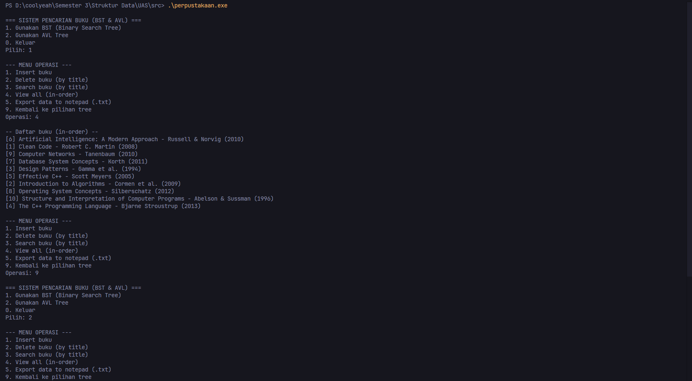

# 📖 Sistem Pencarian Buku di Perpustakaan

### Tugas EAS Struktur Data C081
- Davi Firdaus Handara (24081010034)
- Steve Ulrich (24081010210)

<p>Program C++ yang mengimplementasikan struktur Tree dengan metode BST dan AVL. Program memiliki 2 file ekstensi, file header dan file C++.</p>

# 📸 Screenshot Program



# 📂 Struktur Folder
```
UAS/
│
├── src/                 # Berisi file sumber (.cpp)
│   ├── main.cpp
│   ├── bst.cpp
│   ├── avl.cpp
│   └── perpustakaan.exe
│
├── header/              # Berisi file header (.h)
│   ├── book.h
│   ├── bst.h
│   └── avl.h
│
└── README.md            # Dokumentasi project
```
# ☁️ Git Clone
```
git clone https://github.com/dapi-pdf/UAS-Struktur-Data.git
```

# 🛠️ Build
```
cd src
```
```
g++ main.cpp bst.cpp avl.cpp -o perpustakaan.exe -std=c++17
// file execute akan masuk di folder src
```
```
./perpustakaan.exe
```